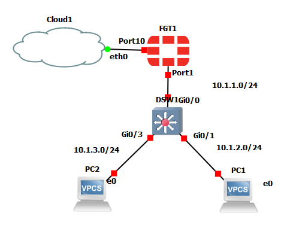

FortiGate DHCP Lab
==========================================

GNS3



FGT1
-----------------------

http://192.168.126.129/

EXT 10.0.0.0/24 gateway 10.0.0.1
NAT
Cloud 192.168.126.0/24
port10 192.168.126.129
port1 10.1.1.1/24

```
config system interface
    edit "port1"
        set vdom "root"
        set ip 10.1.1.1 255.255.255.0
        set allowaccess ping https ssh http fgfm
    next
    edit "port10"
        set vdom "root"
        set mode dhcp
        set allowaccess ping https ssh http fgfm
    next
end
config router static
    edit 1
        set dst 10.1.2.0 255.255.255.0
        set gateway 10.1.1.10
        set device port1
    next
    edit 2
        set dst 10.1.3.0 255.255.255.0
        set gateway 10.1.1.10
        set device port1
    next
end
```

FortiGateVM 初期設定 | さくらのクラウド ドキュメント
https://manual.sakura.ad.jp/cloud/marketplace/fortigate/fortigate-start.html

```
get system interface physical
```

PC1

```
ip 10.1.1.111/24 10.1.1.1
ip dhcp
save
```

PC1

```
ip 10.1.2.111/24 10.1.2.10
save
```

PC2

```
ip 10.1.3.112/24 10.1.3.10
save
```

DSW1

```
configure terminal
!
ip route 0.0.0.0 0.0.0.0 10.1.1.1
!
interface gig0/0
    no switchport
    ip address 10.1.1.10 255.255.255.0
!
interface gig0/1
    no switchport
    ip address 10.1.2.10 255.255.255.0
    ip helper-address 10.1.1.1
!
interface gig0/3
    no switchport
    ip address 10.1.3.10 255.255.255.0
    ip helper-address 10.1.1.1
!
line console 0
    logging synchronous
!
line vty 0 15
    logging synchronous
!
end
write
```

Technical Note: Configuration of a DHCP server with multiple pools on the same interface - Fortinet Community
https://community.fortinet.com/t5/FortiGate/Technical-Note-Configuration-of-a-DHCP-server-with-multiple/ta-p/191977

FortiGate で DHCP サーバ機能を設定する方法（v6.2.6） | matsublog
https://nwengblog.com/fortigate-dhcp/

```
config system dhcp server
    edit 1
        set dns-service default
        set default-gateway 10.1.1.1
        set netmask 255.255.255.0
        set interface "port1"
        config ip-range
            edit 1
                set start-ip 10.1.1.2
                set end-ip 10.1.1.254
            next
        end
    next
end
```

↓

```
config system dhcp server
    edit 1
        set dns-service default
        set default-gateway 10.1.1.1
        set netmask 255.255.255.0
        set interface "port1"
        config ip-range
            edit 1
                set start-ip 10.1.1.2
                set end-ip 10.1.1.254
            next
        end
    next
    edit 2
        set dns-service specify
        set default-gateway 10.1.2.10
        set netmask 255.255.255.0
        set interface "port1"
        config ip-range
            edit 1
                set start-ip 10.1.2.150
                set end-ip 10.1.2.200
            next
        end
        set lease-time 14400
        set dns-server1 8.8.8.8
        set dns-server2 8.8.4.4
        set dns-server3 1.1.1.1
    next
    edit 3
        set dns-service specify
        set default-gateway 10.1.3.10
        set netmask 255.255.255.0
        set interface "port1"
        config ip-range
            edit 1
                set start-ip 10.1.3.150
                set end-ip 10.1.3.200
            next
        end
        set lease-time 14400
        set dns-server1 8.8.8.8
        set dns-server2 8.8.4.4
        set dns-server3 1.1.1.1
    next

end
```
